# Minimum Cost to of cutting tin into squares
Altrnative solution to problem from www.geeksforgeeks.org/minimum-cost-cut-board-squares/

A board (tin) of length m and width n is given, we need to break it into m*n squares such that cost of breaking is minimum. Cutting cost for each edge will be given for the board. In short we need to choose such a sequence of cutting that toatal cost is minimized.

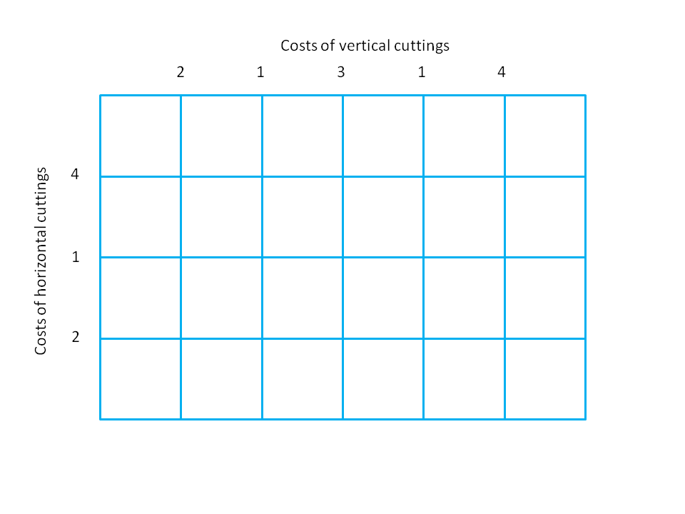
Cuts are made starting from the most expensive, with the vertical and horizontal cuts being mixed up.
# 
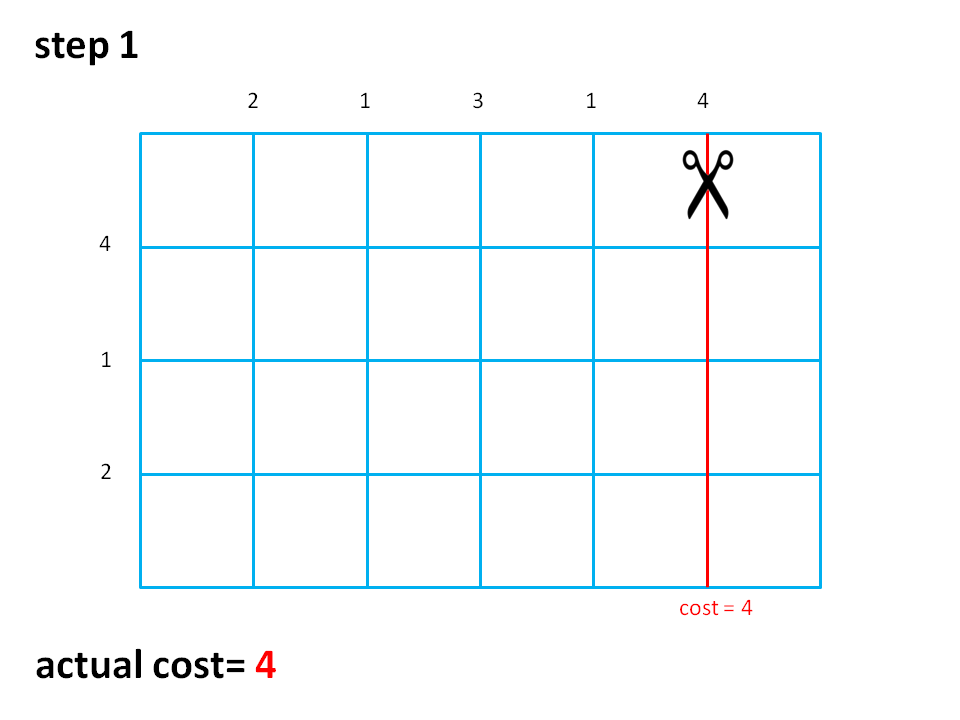  
# 
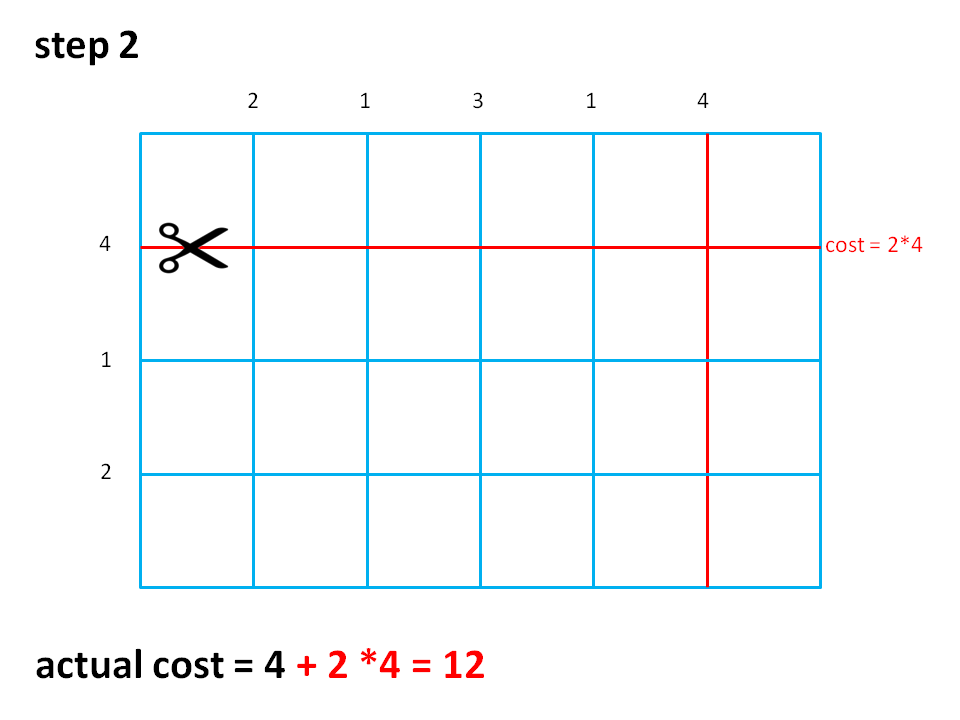
# 
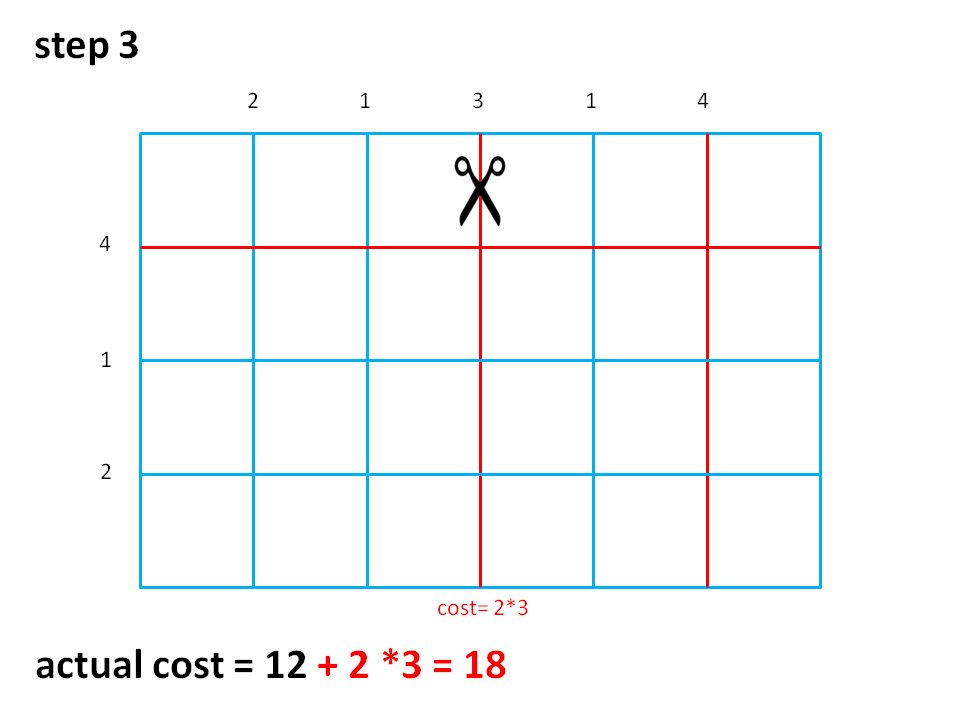
# 
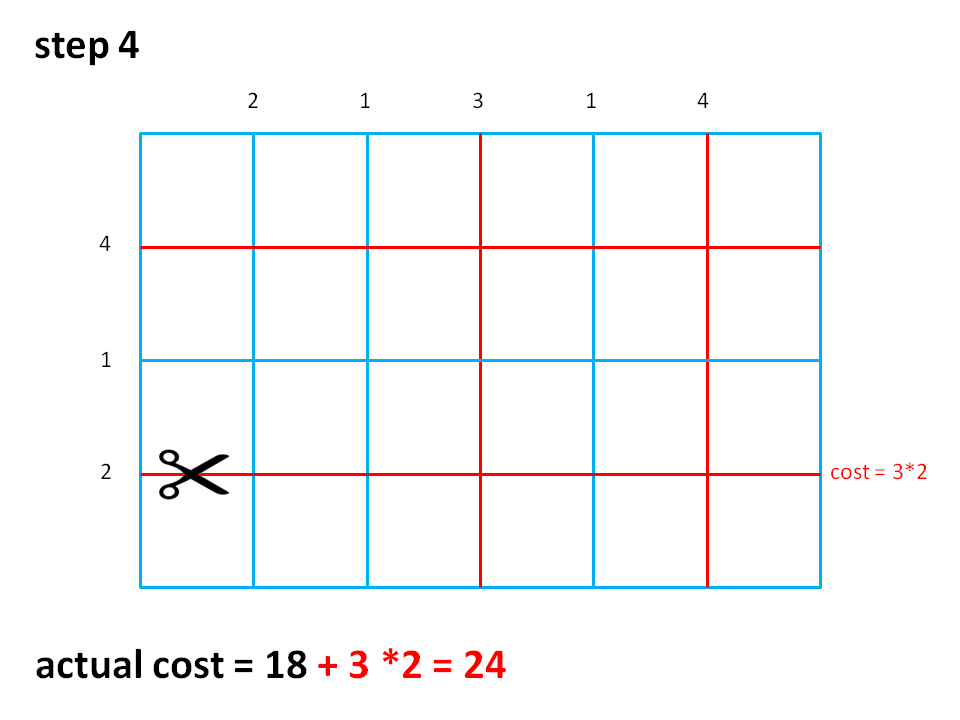
# 
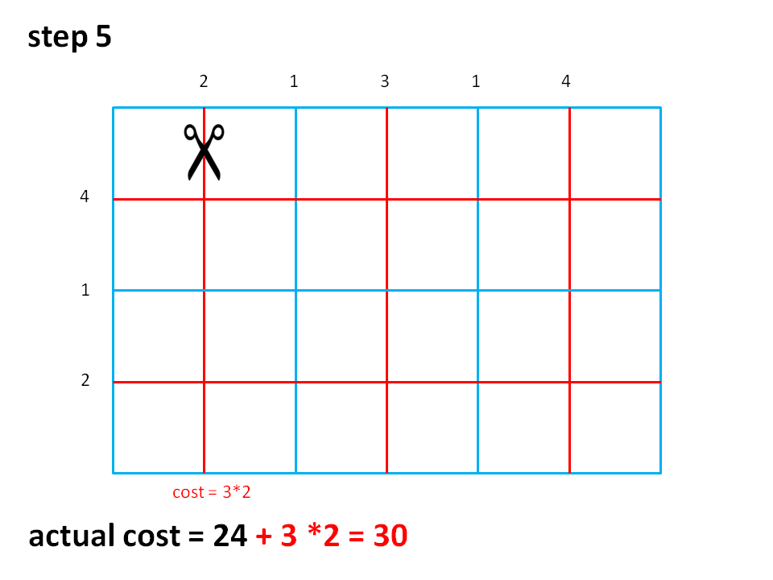
# 
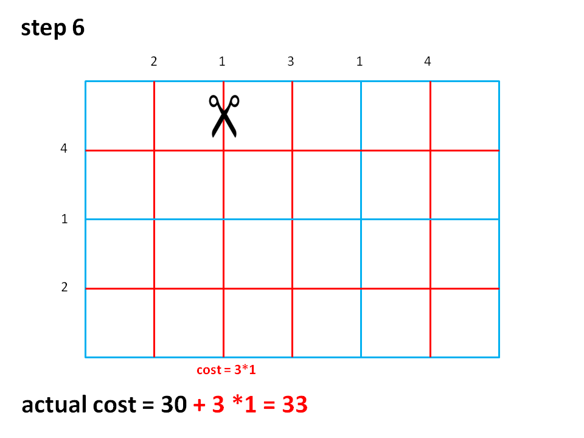
# 
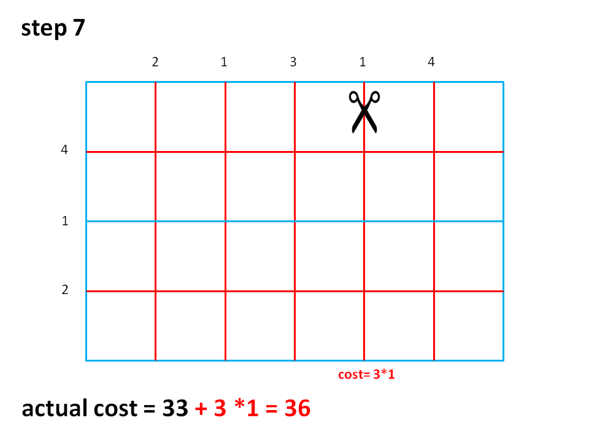
# 
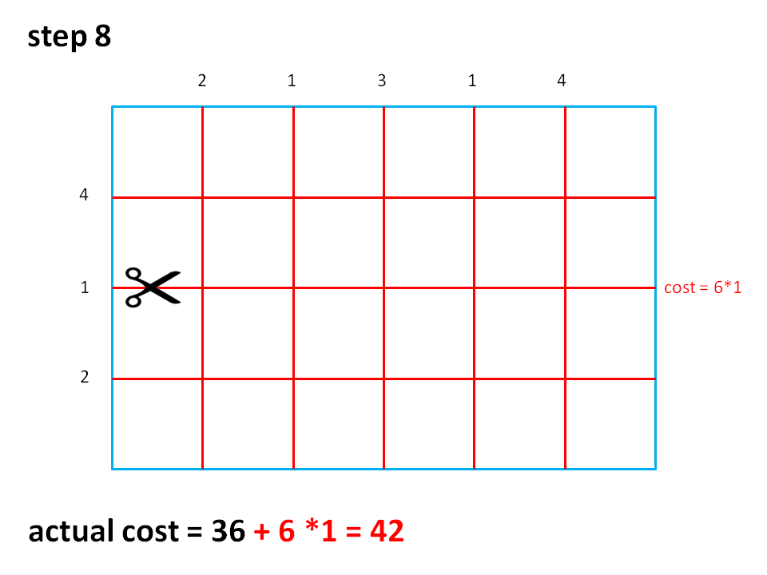

## total cost=42

# Cutting
Fragment before cutting:  
```Fragment(startX, startY, dimX, dimY));```

Two fragments after vertical cutting at cutPosition:  
```Fragment(startX, startY, cutPosition, dimY));```  
```Fragment(cutPosition + 1, startY, endX - cutPosition, dimY));``` 

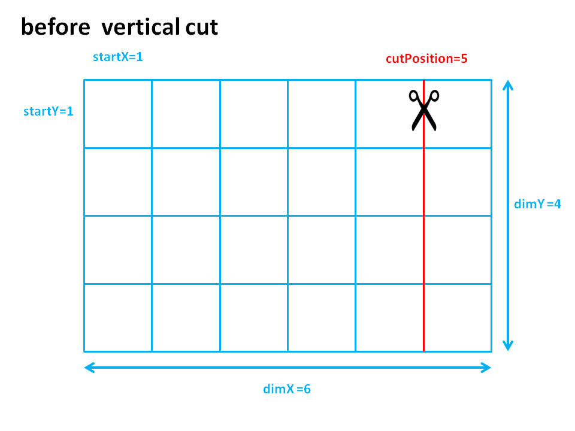
#  
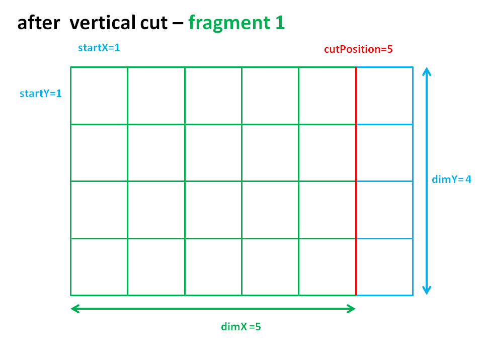
```startX = startX = 1;```  
```startY = startY = 1;```  
```dimX = cutPosition = 5;```  
```dimY = dimY = 4;```
# 
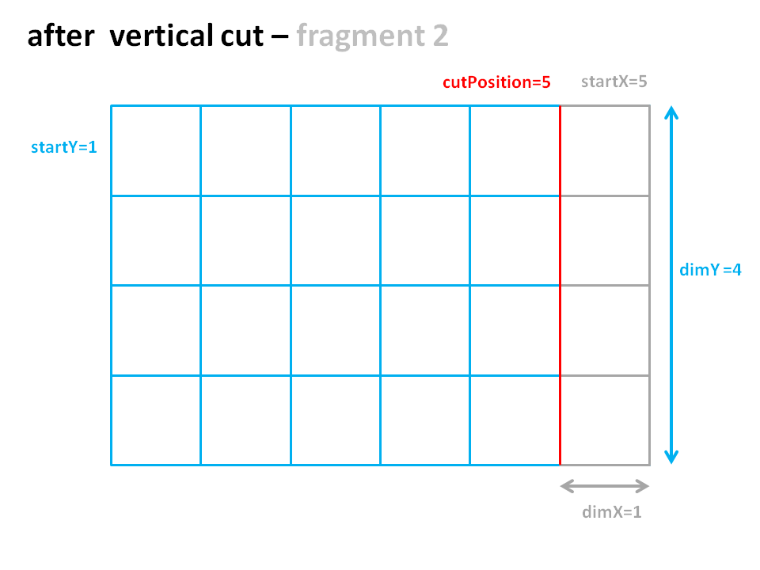
```startX = cutPosition + 1 = 5+1 = 6;```  
```startY = startY = 1;```  
```dimX = endX - cutPosition = 6-5 = 1;```  
```dimY = dimY = 4;```


